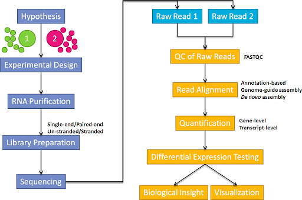

```{r setup, include=FALSE}
knitr::opts_chunk$set(echo = TRUE)
```

(Adapted from the Data Carpentry Genomics wrangling materials at:- https://datacarpentry.org/wrangling-genomics/00-quality-control/index.html)

# Bioinformatics workflows

When working with high-throughput sequencing data, the raw reads you get off of the sequencer will need to pass
through a number of  different tools in order to generate your final desired output. The execution of this set of
tools in a specified order is commonly referred to as a *workflow* or a *pipeline*. 

An example of the workflow we will be using for our RNA-seq analysis is provided below with a brief
description of each step. 




1. Quality control - Assessing quality using FastQC
2. Align reads to reference genome 
3. Quantification to obtain gene-level counts post-alignment clean-up
4. Differential Expression

These workflows in bioinformatics adopt a plug-and-play approach in that the output of one tool can be easily
used as input to another tool without any extensive configuration. Having standards for data formats is what 
makes this feasible. Standards ensure that data is stored in a way that is generally accepted and agreed upon 
within the community. The tools that are used to analyze data at different stages of the workflow are therefore 
built under the assumption that the data will be provided in a specific format.  


# Quality Control

The first step in the variant calling workflow is to take the FASTQ files received from the sequencing facility
and assess the quality of the sequence reads. 

## Details on the FASTQ format

Although it looks complicated (and it is), it's easy to understand the
[fastq](https://en.wikipedia.org/wiki/FASTQ_format) format with a little decoding. Some rules about the format
include...

|Line|Description|
|----|-----------|
|1|Always begins with '@' and then information about the read|
|2|The actual DNA sequence|
|3|Always begins with a '+' and sometimes the same info in line 1|
|4|Has a string of characters which represent the quality scores; must have same number of characters as line 2|

We can view the first complete read in one of the files our dataset by using `head` to look at
the first four lines.

```{bash eval=FALSE}
$ head -n4 SRR098026.fastq
```

```

@SRR098026.1 HWUSI-EAS1599_1:2:1:0:968 length=35
NNNNNNNNNNNNNNNNCNNNNNNNNNNNNNNNNNN
+SRR098026.1 HWUSI-EAS1599_1:2:1:0:968 length=35
!!!!!!!!!!!!!!!!#!!!!!!!!!!!!!!!!!!

```


All but one of the nucleotides in this read are unknown (`N`). This is a pretty bad read!

Line 4 shows the quality for each nucleotide in the read. Quality is interpreted as the 
probability of an incorrect base call (e.g. 1 in 10) or, equivalently, the base call 
accuracy (eg 90%). To make it possible to line up each individual nucleotide with its quality
score, the numerical score is converted into a code where each individual character 
represents the numerical quality score for an individual nucleotide. For example, in the line
above, the quality score line is: 

```
!!!!!!!!!!!!!!!!#!!!!!!!!!!!!!!!!!!

```


The `#` character and each of the `!` characters represent the encoded quality for an 
individual nucleotide. The numerical value assigned to each of these characters depends on the 
sequencing platform that generated the reads. The sequencing machine used to generate our data 
uses the standard Sanger quality PHRED score encoding, using by Illumina version 1.8 onwards.
Each character is assigned a quality score between 0 and 40 as shown in the chart below.

```
Quality encoding: !"#$%&'()*+,-./0123456789:;<=>?@ABCDEFGHI
                  |         |         |         |         |
Quality score:    0........10........20........30........40                                
```

Each quality score represents the probability that the corresponding nucleotide call is
incorrect. This quality score is logarithmically based, so a quality score of 10 reflects a
base call accuracy of 90%, but a quality score of 20 reflects a base call accuracy of 99%. 
These probability values are the results from the base calling algorithm and dependent on how 
much signal was captured for the base incorporation. 

Looking back at our read: 

```
@SRR098026.1 HWUSI-EAS1599_1:2:1:0:968 length=35
NNNNNNNNNNNNNNNNCNNNNNNNNNNNNNNNNNN
+SRR098026.1 HWUSI-EAS1599_1:2:1:0:968 length=35
!!!!!!!!!!!!!!!!#!!!!!!!!!!!!!!!!!!

```

we can now see that the quality of each of the `N`s is 0 and the quality of the only
nucleotide call (`C`) is also very poor (`#` = a quality score of 2). This is indeed a very
bad read. 

> ## Exercise
> 
> What is the last read in the `SRR098026.fastq` file? How confident
> are you in this read? 
> 

## Quality Encodings Vary

 Although we've used a particular quality encoding system to demonstrate interpretation of 
 read quality, different sequencing machines use different encoding systems. This means that, 
 depending on which sequencer you use to generate your data, a `#` may not be an indicator of 
 a poor quality base call.

 This mainly relates to older Solexa/Illumina data,
 but it's essential that you know which sequencing platform was
 used to generate your data, so that you can tell your quality control program which encoding
 to use. If you choose the wrong encoding, you run the risk of throwing away good reads or 
 (even worse) not throwing away bad reads!

## Assessing Quality using FastQC

In real life, you won't be assessing the quality of your reads by visually inspecting your 
FASTQ files. Rather, you'll be using a software program to assess read quality and 
filter out poor quality reads. We'll first use a program called [FastQC](http://www.bioinformatics.babraham.ac.uk/projects/fastqc/) to visualize the quality of our reads. 
Later in our workflow, we'll use another program to filter out poor quality reads. 

FastQC has a number of features which can give you a  quick impression of any problems your
data may have, so you can take these issues into consideration before moving forward with your
analyses. Rather than looking at quality scores for each individual read, FastQC looks at
quality collectively across all reads within a sample. The image below shows a FastQC-generated plot that indicates
a very high quality sample:


The x-axis displays the base position in the read, and the y-axis shows quality scores. In this
example, the sample contains reads that are 40 bp long. For each position, there is a 
box-and-whisker plot showing the distribution of quality scores for all reads at that position.
The horizontal red line indicates the median quality score and the yellow box shows the 2nd to
3rd quartile range. This means that 50% of reads have a quality score that falls within the
range of the yellow box at that position. The whiskers show the range to the 1st and 4th 
quartile.

For each position in this sample, the quality values do not drop much lower than 32. This 
is a high quality score. The plot background is also color-coded to identify good (green),
acceptable (yellow), and bad (red) quality scores.

Now let's take a look at a quality plot on the other end of the spectrum. 


Here, we see positions within the read in which the boxes span a much wider range. Also, quality scores drop quite low into the "bad" range, particularly on the tail end of the reads. The FastQC tool produces several other diagnostic plots to assess sample quality, in addition to the one plotted above. 

## Running FastQC  

We will be working with a set of sample data that is located in the directory (`rnaseq_data`). These files have been compressed, so have the `fastq.gz` extension.


Navigate to your FASTQ dataset: 

```{bash eval=FALSE}
cd ~/rnaseq_data/
```


> ## Exercise
> 
> How many FASTQ files are in this dataset? How big are the files? 
> (Hint: Look at the options for the `ls` command to see how to show
> file sizes.)
>

As the `fastq` files are compressed, we can't use the `cat`, `head` or `tail` commands to view the contents (try it and see what happens!). Instead we can use the command `zcat` to print the contents of the screen to the file.

> ## Exercise
> The command `zcat` can be used instead of `cat` to print the contents of a fastq file to the screen. Can you write a series of commands with a pipe `|` to print the first 4 lines of file `SRR1552444.fastq.gz` to the screen?


To run the FastQC program, we would normally have to tell our computer where the program is located. In this particular case, FastQC has been installed in a location that can be accessed from all directories. 

```{bash eval=FALSE}
which fastqc
```

```
/usr/local/bin/fastqc
```

FastQC can accept multiple file names as input, so we can use the `*.fastq.gz` wildcard to run FastQC on all of the FASTQ files in this directory.

```{bash eval=FALSE}
fastqc *.fastq.gz
```


You will see an automatically updating output message telling you the 
progress of the analysis. It will start like this: 


```
Started analysis of SRR1552444.fastq.gz
Approx 100% complete for SRR1552444.fastq.gz
Analysis complete for SRR1552444.fastq.gz

```

In total, it should take less than 1 minute for FastQC to run on all
of our FASTQ files. When the analysis completes, your prompt
will return. So your screen will look something like this:

```
Started analysis of SRR1552455.fastq.gz
Approx 100% complete for SRR1552455.fastq.gz
Analysis complete for SRR1552455.fastq.gz

```

The FastQC program has created several new files within our
`~/rnaseq_data/` directory. 

```{bash eval=FALSE}
ls
```


```
SRR1552444.fastq.gz     SRR1552446.fastq.gz     SRR1552448.fastq.gz     SRR1552450.fastq.gz     SRR1552452.fastq.gz     SRR1552454.fastq.gz
SRR1552444_fastqc.html  SRR1552446_fastqc.html  SRR1552448_fastqc.html  SRR1552450_fastqc.html  SRR1552452_fastqc.html  SRR1552454_fastqc.html
SRR1552444_fastqc.zip   SRR1552446_fastqc.zip   SRR1552448_fastqc.zip   SRR1552450_fastqc.zip   SRR1552452_fastqc.zip   SRR1552454_fastqc.zip
SRR1552445.fastq.gz     SRR1552447.fastq.gz     SRR1552449.fastq.gz     SRR1552451.fastq.gz     SRR1552453.fastq.gz     SRR1552455.fastq.gz
SRR1552445_fastqc.html  SRR1552447_fastqc.html  SRR1552449_fastqc.html  SRR1552451_fastqc.html  SRR1552453_fastqc.html  SRR1552455_fastqc.html
SRR1552445_fastqc.zip   SRR1552447_fastqc.zip   SRR1552449_fastqc.zip   SRR1552451_fastqc.zip   SRR1552453_fastqc.zip   SRR1552455_fastqc.zip

```


For each input FASTQ file, FastQC has created a `.zip` file and a
`.html` file. The `.zip` file extension indicates that this is 
actually a compressed set of multiple output files. We'll be working
with these output files soon. The `.html` file is a stable webpage
displaying the summary report for each of our samples.

We want to keep our data files and our results files separate, so we
will move these
output files into a new directory within our `results/` directory.


```{bash eval=FALSE}
mv *.html results/
mv *.zip results/
```


## Combining the reports with `multiqc`

It can be quite tiresome to click through multiple QC reports and compare the results for different samples. It is useful to have all the QC plots on the same page so that we can more easily spot trends in the data.

The multiqc tool has been designed for the tasks of aggregating qc reports and combining into a single report that is easy to digest.

```{bash eval=FALSE}
multiqc
multiqc --help
```


> ## Exercise
> 
> Use the multiqc tool to create a single QC report for the dataset.
> Look at the help for the tool, and figure out how to run the tool on the fastqc output we have just generated


The environment that we are working inside includes a version of the Firefox web browser. We can open a particular HTML file with firefox using the command:-

```
firefox results/SRR1552444_fastqc.html 
```

> ## Exercise
> 
> Discuss your results with a neighbour. Which sample(s) looks the best
> in terms of per base sequence quality? Which sample(s) look the
> worst?
> 


## Unzipping Compressed Files

Now that we've looked at our HTML reports to get a feel for the data,
let's look more closely at the other output files. Make sure you're in
our results subdirectory.   


```{bash eval=FALSE}
cd ~/rnaseq_data/results/
ls
```


```
SRR1552444_fastqc.html  SRR1552446_fastqc.html  SRR1552448_fastqc.html  SRR1552450_fastqc.html  SRR1552452_fastqc.html  SRR1552454_fastqc.html
SRR1552444_fastqc.zip   SRR1552446_fastqc.zip   SRR1552448_fastqc.zip   SRR1552450_fastqc.zip   SRR1552452_fastqc.zip   SRR1552454_fastqc.zip
SRR1552445_fastqc.html  SRR1552447_fastqc.html  SRR1552449_fastqc.html  SRR1552451_fastqc.html  SRR1552453_fastqc.html  SRR1552455_fastqc.html
SRR1552445_fastqc.zip   SRR1552447_fastqc.zip   SRR1552449_fastqc.zip   SRR1552451_fastqc.zip   SRR1552453_fastqc.zip   SRR1552455_fastqc.zip

```


Our `.zip` files are compressed files. They each contain multiple 
different types of output files for a single input FASTQ file. To
view the contents of a `.zip` file, we can use the program `unzip` 
to decompress these files. Let's try doing them all at once using a
wildcard.

```{bash eval=FALSE}
unzip *.zip
```

```
Archive:  SRR1552444_fastqc.zip
caution: filename not matched:  SRR1552445_fastqc.zip
caution: filename not matched:  SRR1552446_fastqc.zip
caution: filename not matched:  SRR1552447_fastqc.zip
caution: filename not matched:  SRR1552448_fastqc.zip
caution: filename not matched:  SRR1552449_fastqc.zip
caution: filename not matched:  SRR1552450_fastqc.zip
caution: filename not matched:  SRR1552451_fastqc.zip
caution: filename not matched:  SRR1552452_fastqc.zip
caution: filename not matched:  SRR1552453_fastqc.zip
caution: filename not matched:  SRR1552454_fastqc.zip
caution: filename not matched:  SRR1552455_fastqc.zip

```

This didn't work. We unzipped the first file and then got a warning
message for each of the other `.zip` files. This is because `unzip` 
expects to get only one zip file as input. We could go through and 
unzip each file one at a time, but this is very time consuming and 
error-prone. Someday you may have 500 files to unzip!

A more efficient way is to use a `for` loop to iterate through all of
our `.zip` files. Let's see what that looks like and then we'll 
discuss what we're doing with each line of our loop.

```{bash eval=FALSE}
for filename in *.zip
do
unzip $filename
done
```


When the shell sees the keyword `for`,
it knows to repeat a command (or group of commands) once for each item in a list.
Each time the loop runs (called an iteration), an item in the list is assigned in sequence to
the **variable**, and the commands inside the loop are executed, before moving on to 
the next item in the list.

Inside the loop,
we call for the variable's value by putting `$` in front of it.
The `$` tells the shell interpreter to treat
the **variable** as a variable name and substitute its value in its place,
rather than treat it as text or an external command. 

In this example, the list is six filenames (one filename for each of our `.zip` files).
Each time the loop iterates, it will assign a file name to the variable `filename`
and run the `unzip` command.
The first time through the loop,
`$filename` is `SRR1552444_fastqc.zip`. 
The interpreter runs the command `unzip` on `SRR1552444_fastqc.zip`.
For the second iteration, `$filename` becomes 
`SRR1552445_fastqc.zip`. This time, the shell runs `unzip` on `SRR1552445_fastqc.zip`.
It then repeats this process for the four other `.zip` files in our directory.

### Follow the Prompt

 The shell prompt changes from `$` to `>` and back again as we were
 typing in our loop. The second prompt, `>`, is different to remind
 us that we haven't finished typing a complete command yet. A semicolon, `;`,
 can be used to separate two commands written on a single line.


 Here we see `>` being used a shell prompt, whereas `>` is also
 used to redirect output.
 Similarly, `$` is used as a shell prompt, but, as we saw earlier,
 it is also used to ask the shell to get the value of a variable.

 If the *shell* prints `>` or `$` then it expects you to type something,
 and the symbol is a prompt.

 If *you* type `>` or `$` yourself, it is an instruction from you that
 the shell to redirect output or get the value of a variable.

We have called the variable in this loop `filename`
in order to make its purpose clearer to human readers.
The shell itself doesn't care what the variable is called;
if we wrote this loop as:


```{bash eval=FALSE}
for x in *.zip
do
unzip $x
done
```


or:

```{bash eval=FALSE}
for temperature in *.zip
do
unzip $temperature
done
```


it would work exactly the same way.
*Don't do this.*
Programs are only useful if people can understand them,
so meaningless names (like `x`) or misleading names (like `temperature`)
increase the odds that the program won't do what its readers think it does.

### Multipart commands
 The `for` loop is interpreted as a multipart command.  If you press the up arrow on your keyboard to recall the command, it will be shown like so:

```
$ for zip in *.zip; do echo File $zip; unzip $zip; done
```

When you check your history later, it will help your remember what you did!

When we run our `for` loop, you will see output that starts like this:

```
File SRR1552444_fastqc.zip
Archive:  SRR1552444_fastqc.zip
   creating: SRR1552444_fastqc/
   creating: SRR1552444_fastqc/Icons/
   creating: SRR1552444_fastqc/Images/
  inflating: SRR1552444_fastqc/Icons/fastqc_icon.png  
  inflating: SRR1552444_fastqc/Icons/warning.png  
  inflating: SRR1552444_fastqc/Icons/error.png  
  inflating: SRR1552444_fastqc/Icons/tick.png  
  inflating: SRR1552444_fastqc/summary.txt  

```


The `unzip` program is decompressing the `.zip` files and creating
a new directory (with subdirectories) for each of our samples, to 
store all of the different output that is produced by FastQC. There
are a lot of files here. The one we're going to focus on is the 
`summary.txt` file. 

## Understanding FastQC Output

If you list the files in our directory now you will see: 

```
SRR1552444_fastqc       SRR1552446_fastqc       SRR1552448_fastqc       SRR1552450_fastqc       SRR1552452_fastqc       SRR1552454_fastqc
SRR1552444_fastqc.html  SRR1552446_fastqc.html  SRR1552448_fastqc.html  SRR1552450_fastqc.html  SRR1552452_fastqc.html  SRR1552454_fastqc.html
SRR1552444_fastqc.zip   SRR1552446_fastqc.zip   SRR1552448_fastqc.zip   SRR1552450_fastqc.zip   SRR1552452_fastqc.zip   SRR1552454_fastqc.zip
SRR1552445_fastqc       SRR1552447_fastqc       SRR1552449_fastqc       SRR1552451_fastqc       SRR1552453_fastqc       SRR1552455_fastqc
SRR1552445_fastqc.html  SRR1552447_fastqc.html  SRR1552449_fastqc.html  SRR1552451_fastqc.html  SRR1552453_fastqc.html  SRR1552455_fastqc.html
SRR1552445_fastqc.zip   SRR1552447_fastqc.zip   SRR1552449_fastqc.zip   SRR1552451_fastqc.zip   SRR1552453_fastqc.zip   SRR1552455_fastqc.zip

```


The `.html` files and the uncompressed `.zip` files are still present,
but now we also have a new directory for each of our samples. We can 
see for sure that it's a directory if we use the `-F` flag for `ls`. 

```{bash eval=FALSE}
ls -F
```

```
SRR1552444_fastqc/      SRR1552446_fastqc/      SRR1552448_fastqc/      SRR1552450_fastqc/      SRR1552452_fastqc/      SRR1552454_fastqc/
SRR1552444_fastqc.html  SRR1552446_fastqc.html  SRR1552448_fastqc.html  SRR1552450_fastqc.html  SRR1552452_fastqc.html  SRR1552454_fastqc.html
SRR1552444_fastqc.zip   SRR1552446_fastqc.zip   SRR1552448_fastqc.zip   SRR1552450_fastqc.zip   SRR1552452_fastqc.zip   SRR1552454_fastqc.zip
SRR1552445_fastqc/      SRR1552447_fastqc/      SRR1552449_fastqc/      SRR1552451_fastqc/      SRR1552453_fastqc/      SRR1552455_fastqc/
SRR1552445_fastqc.html  SRR1552447_fastqc.html  SRR1552449_fastqc.html  SRR1552451_fastqc.html  SRR1552453_fastqc.html  SRR1552455_fastqc.html
SRR1552445_fastqc.zip   SRR1552447_fastqc.zip   SRR1552449_fastqc.zip   SRR1552451_fastqc.zip   SRR1552453_fastqc.zip   SRR1552455_fastqc.zip
```

```{bash eval=FALSE}
ls -F SRR1552444_fastqc/
```


Let's see what files are present within one of these output directories.


```
fastqc_data.txt  fastqc.fo  fastqc_report.html	Icons/	Images/  summary.txt
```

Use `less` to preview the `summary.txt` file for this sample. 

```{bash eval=FALSE}
less SRR1552444_fastqc/summary.txt 
```

```
PASS    Basic Statistics        SRR1552444.fastq.gz
PASS    Per base sequence quality       SRR1552444.fastq.gz
PASS    Per tile sequence quality       SRR1552444.fastq.gz
PASS    Per sequence quality scores     SRR1552444.fastq.gz
FAIL    Per base sequence content       SRR1552444.fastq.gz
WARN    Per sequence GC content SRR1552444.fastq.gz
WARN    Per base N content      SRR1552444.fastq.gz
PASS    Sequence Length Distribution    SRR1552444.fastq.gz
PASS    Sequence Duplication Levels     SRR1552444.fastq.gz
WARN    Overrepresented sequences       SRR1552444.fastq.gz
PASS    Adapter Content SRR1552444.fastq.gz
PASS    Kmer Content    SRR1552444.fastq.gz

```

The summary file gives us a list of tests that FastQC ran, and tells
us whether this sample passed, failed, or is borderline (`WARN`).

## Documenting Our Work

We can make a record of the results we obtained for all our samples
by concatenating all of our `summary.txt` files into a single file 
using the `cat` command. We'll call this `full_report.txt` 

```{bash eval=FALSE}
cat */summary.txt > fastqc_summaries.txt
```


> ## Exercise
> 
> Which samples failed at least one of FastQC's quality tests? What
> test(s) did those samples fail?
>
