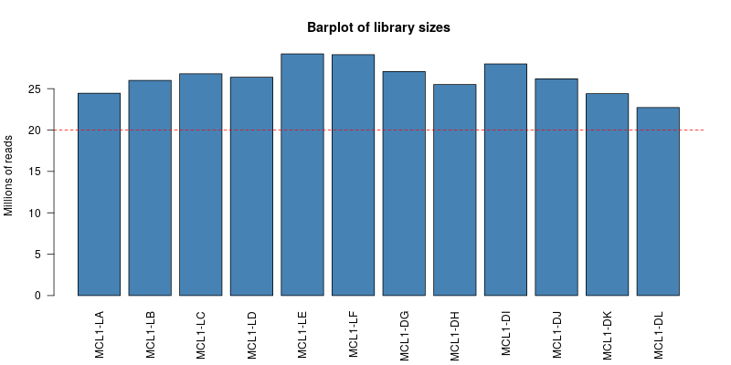

**Original Authors: Belinda Phipson, Anna Trigos, Matt Ritchie, Maria Doyle, Harriet Dashnow, Charity Law**, **Stephane Ballereau, Oscar Rueda, Ashley Sawle**
Based on the course [RNAseq analysis in R](http://combine-australia.github.io/2016-05-11-RNAseq/) delivered on May 11/12th 2016 and modified by Cancer Research Uk Cambridge Centre for the [Functional Genomics Autumn School 2017](https://bioinformatics-core-shared-training.github.io/cruk-autumn-school-2017/)

```{r knitrOpts, include=FALSE}
knitr::opts_chunk$set(echo = TRUE)
```


## Resources and data files

This material has been created using the following resources:  

- http://www.statsci.org/smyth/pubs/QLedgeRPreprint.pdf [@Lun2016]  
- http://monashbioinformaticsplatform.github.io/RNAseq-DE-analysis-with-R/99-RNAseq_DE_analysis_with_R.html  
- http://bioconductor.org/packages/devel/bioc/vignettes/DESeq2/inst/doc/DESeq2.html
- https://bioconductor.github.io/BiocWorkshops/rna-seq-data-analysis-with-deseq2.html


## Overview

* Reading in table of counts
* Filtering lowly expressed genes
* Quality control
* Normalisation for composition bias


## Introduction

Measuring gene expression on a genome-wide scale has become common practice over the last two decades or so, with microarrays predominantly used pre-2008. With the advent of next generation sequencing technology in 2008, an increasing number of scientists use this technology to measure and understand changes in gene expression in often complex systems. As sequencing costs have decreased, using RNA-Seq to simultaneously measure the expression of tens of thousands of genes for multiple samples has never been easier. The cost of these experiments has now moved from generating the data to storing and analysing it.

There are many steps involved in analysing an RNA-Seq experiment. Analysing an RNAseq experiment begins with sequencing reads. Traditionally, these are aligned to a reference genome, then the number of reads mapped to each gene can be counted. More modern approaches such as `salmon` quantify transcripts directly and do not require genome aligment  to have taken place. Either approach results in a table of counts, which is what we perform statistical analyses on in R. While mapping and counting are important and necessary tasks, this session will be starting from the count data and getting stuck into analysis.

We will be following a workflow that uses the `DESeq2` package. An alternative and well-respected workflow is based on the [edgeR and limma packages](https://bioconductor.github.io/BiocWorkshops/rna-seq-analysis-is-easy-as-1-2-3-with-limma-glimma-and-edger.html).

### Mouse mammary gland dataset

The data for this tutorial comes from a Nature Cell Biology paper, [*EGF-mediated induction of Mcl-1 at the switch to lactation is essential for alveolar cell survival*](http://www.ncbi.nlm.nih.gov/pubmed/25730472) [@Fu2015]. 

This study examines the expression profiles of basal stem-cell enriched cells (B) and committed luminal cells (L) in the mammary gland of virgin, pregnant and lactating mice. Six groups are present, with one for each combination of cell type and mouse status. Each group contains two biological replicates.

The sequencing reads for this experiment were uploaded to the [Sequencing Read Archive (SRA)](https://www.ncbi.nlm.nih.gov/sra?term=SRP045534) and details of how to obtain the raw reads and process are given in the session "Preparing fastq files for analysis in R".

## Obtaining the metadata


The `sampleInfo.txt` in the `meta_data` folder contains basic information about the samples that we will need for the analysis today. This includes the ID for the sample from SRA, an ID assigned by the researcher, and the cell type and developmental stage for each sample.

```{r loadSampleInfo}
# Read the sample information into R
sampleinfo <- read.delim("meta_data/sampleInfo.txt")
View(sampleinfo)
sampleinfo
rownames(sampleinfo) <- sampleinfo$run
```


## Reading in the count data

### Overview

We are going to use the [`tximport`](http://dx.doi.org/10.12688/f1000research.7563.1) package to import the count data into R and collapse the data to the *gene level*. This requires us to run a function in the following form:-

```{r eval=FALSE}
txi <- tximport(files=..., type="salmon", tx2gene=...)
```

So we will need to define the files that we want to import and a transcript mapping data frame. The transcript mapping takes the form 

```
 | TXNAME | GENEID
1| ENST00000456328.2 |  ENSG00000223972.5
2| ENST00000450305.2 | ENSG00000223972.5
3| ENST00000473358.1 | ENSG00000243485.5
4| ENST00000469289.1 | ENSG00000243485.5
5| ENST00000607096.1 | ENSG00000284332.1
6| ENST00000606857.1 | ENSG00000268020.3
```

`tximport` is able to import counts produced by different software, and different workflows are described for each in the [tximport vignette](https://bioconductor.org/packages/devel/bioc/vignettes/tximport/inst/doc/tximport.html).

## Identifying the files

The samples from this study have been *quantified* using `salmon`. For details on how this is done, please see the previous session on preparing fastq files for analysis.

The script we used to run salmon (`run_salmon.sh`) created a separate folder for each sample (named according to the SRA ID), and inside each of these folders we find the salmon quantification file. Note that the salmon analysis produced many other files (e.g. log files), but we will only need the `quant.sf.gz` files for analysis.


The function we are going to use to import the salmon files requires a `vector` comprising the paths to the files that are to be imported. To construct such a vector we can use the following code chunk. Furthermore, we can name each item in the vector according to the directory name. These names will be used eventually to name the columns of our count matrices.

```{r}
dirs <- list.files(file.path("salmon_quant/"))
quant_files <- paste0("salmon_quant/",dirs,"/quant.sf.gz")
names(quant_files) <- dirs
quant_files
```

### Inspecting the salmon output

The quant files are simple tab-delimited files that tabulate the counting results for each transcript in our chosen organism. Although we will use a specialised Bioconductor package (`tximport`) to import the counts for entire dataset into R, we can inspect the first of the files using the standard `read_tsv` function from the `readr` package.


```{r}
library(readr)
quants <- read_tsv(quant_files[1])
head(quants)

```


Various methods have been proposed to account for the two main known biases in RNA-seq; library composition and gene length. A nice summary is presented on [this blog](https://www.rna-seqblog.com/rpkm-fpkm-and-tpm-clearly-explained/). The current favourite is *TPM* (transcripts per million) which is similar in concept to *RPKM*, but the different order in which operations are applied makes it easier to compare across samples.

The *TPM* are giving in the table, but we can demonstrate the calculation in a few steps

- divide the number of reads for each transcript by it's length (*reads per kilobase* - RPK)
- sum the RPK values and divide by 1 million to get a scaling factor
- divide the RPK values by the scaling factor to get the *TPM*


```{r}
rpk <- quants$NumReads / quants$EffectiveLength

scale_factor <- sum(rpk) / 1e6

tpm <- rpk / scale_factor

```


### Defining the transcript mapping


In order for `tximport` to give *gene-level* counts, we need to supply a data frame that can be used to associate each transcript name with a gene identifier. **It is important to use a transcript file that corresponds to the name genome build as the file used to count the transcripts**. 

We can check if the `gtf` file exists in the directory we expect by running the `file.exists` function; returning `TRUE` or `FALSE`
```{r}
gtf_file <- "Mus_musculus.GRCm38.91.chr.gtf.gz"
file.exists(gtf_file)
```

If required, we can download from the Ensembl FTP site. 


```{r eval=FALSE} 
download.file("ftp://ftp.ensembl.org/pub/release-91/gtf/mus_musculus/Mus_musculus.GRCm38.91.chr.gtf.gz",destfile = gtf_file)

```


### Note on analysing your own data

![images/download_gtf.png]

If analysing your own data, you will have to locate the gtf file on the Ensembl FTP site. If you enter `ftp://ftp.ensembl.org/pub/release-91/gtf` into a web browser you will be able to navigate the site and find your organism of interest. By right-clicking on the name of the gtf you will be able to copy the URL and then paste into RStudio.

```{r eval=FALSE}
gtf_file <- "ensembl_ref/my_ref.gtf"
download.file(PASTE_LINK_FROM_ENSEMBL_HERE,destfile = gtf_file)
```

### Creating a transcript database

The Bioconducor website provides many pre-built transcript databases for some organisms (Human, Mouse,Rat etc)  which provide transcript definitions and allow users to query the locations of particular genes, exons and other genomic features. You may find a pre-built package that already has the transcript locations required to create the transcript mapping file. Check out the annotation section of the Bioconductor website - http://bioconductor.org/packages/release/BiocViews.html#___AnnotationData and look for packages starting `TxDb...`

However, it is quite easy to build such a database if we have a `gtf` file using the `GenomicFeatures` infrastructure.

```{r message=FALSE}
## Could take a few minutes to run the makeTxDbFromGFF command
library(GenomicFeatures)
txdb <- makeTxDbFromGFF(gtf_file)

```

The database has a number of predefined "keys" and "columns" that have to be specified when creating a query

```{r}
keytypes(txdb)
```

```{r}
columns(txdb)
```

Sometimes we would want to query the positions for a limited set of selected genes (perhaps the results of a differential-expression analysis), but in this case we want the gene names that correspond to every transcript in the database. To get the names of all transcripts we can use the `keys` function. We then compose the query using the `select` function to return a data frame

```{r}
k <- keys(txdb, keytype="TXNAME")
tx_map <- select(txdb, keys = k, columns="GENEID", keytype = "TXNAME")
head(tx_map)
```

Such a data frame *should* be sufficient to allow us to use the `tximport` package. There is a bit of a problem though..

```{r eval=FALSE}
library(tximport)
tx2gene <- tx_map
write.csv(tx2gene,file="tx2gene.csv",row.names = FALSE,quote=FALSE)
txi <- tximport(quant_files,type="salmon",tx2gene = tx2gene)
```

In this case R is reporting a useful error message; the IDs we have supplied in the `tx2gene` data frame do not correspond to the transcript names in our files.

```{r}
table(tx_map$TXNAME %in% quants$Name)
```

Fortunately the authors of `tximport` have recognised this as a common problem and added an argument to the `tximport` function that can be used to overcome the error.

```{r}
library(tximport)
tx2gene <- tx_map
txi <- tximport(quant_files,type="salmon",tx2gene = tx2gene,ignoreTxVersion = TRUE)
```

The resulting object is a simple `list` structure in R which contains a number of components that we can access using a `$` operator

```{r}
names(txi)
```

```{r}
head(txi$counts)
```

```{r}
all(rownames(sampleinfo) == colnames(txi$counts))
```


This was a fairly simple fix, but we could have also used some functionality from the `tidyverse` collection of packages to make the names compatible.

### Fixing the problem with transcript names - the hard way!

None of the transcript names are matching up. If we look at the transcript names in the `quant` files they have a `.` symbol followed by a number after the transcript name. The `tidyr` package contains several useful functions for *tidying* a data frame. One function we will use in particular is to split a column of value that contain multiple pieces of information separated by a common character. In this case the character is "." but other common separating characters include `-`, `_`, `:`. The `separate` function is able to detect which character is being used.

Here we create two new columns, `TXNAME` and `Number`. The `TXNAME` being the column that should match entries in the `tx_map` data frame.

```{r}
library(tidyr)
quants <- separate(quants, Name, c("TXNAME","Number"),remove = FALSE)
head(quants)
```

Another useful piece of `tidyverse` functionality is to join two tables together based on a common column. We want to create a data frame that has the transcript name as it appears in the quant files and the gene name. This can be achieved by a `left_join` to ensure that all the transcript IDs in the quant files have an entry in the combined table.

N.B. those already familiar with R might have encountered the `merge` function for achieving a similar result.

```{r}
library(dplyr)
quants <- left_join(quants, tx_map, by="TXNAME")
head(quants)
```

To create the `tx2gene` we can pull out the columns that we require from this merged data frame. There is another `dplyr` function for doing this that has simpler syntax than the *"base R"* method of subsetting a data frame.

```{r}
tx2gene <- dplyr:::select(quants, Name, GENEID)
head(tx2gene)
```

We might want to further check that there are no "missing values" in the Gene ID column and remove them from the data frame 

```{r}
any(is.na(tx2gene$GENEID))

tx2gene <- filter(tx2gene, !is.na(GENEID))

```


```{r}
library(tximport)

txi <- tximport(quant_files,type="salmon",tx2gene = tx2gene)

```


## Quality control of the imported counts

We will be using the `DESeq2` library to analyse this dataset. As part of the [DESeq2 vignette](http://bioconductor.org/packages/devel/bioc/vignettes/DESeq2/inst/doc/DESeq2.html) you will see examples of importing count data from different sources. In all cases, [raw count data are expected](http://bioconductor.org/packages/devel/bioc/vignettes/DESeq2/inst/doc/DESeq2.html#why-un-normalized-counts). 

For this workflow we are going to import data from `tximport` with the `DESeqDataSetFromTximport` function along with the sample information that we created earlier. 

A *design* for the experiment also needs to be specified. This will define how the differential expression analysis is carried out, but can be changed at a later stage so we will use `CellType` for now as our factor of interest.

```{r message=FALSE}
library(DESeq2)
dds <- DESeqDataSetFromTximport(txi, 
                                colData = sampleinfo,
                                design <- ~CellType)
```

The object contains all the metadata for the experiment, along with the counts. 

```{r}
colData(dds)
```


We will be using these raw counts throughout the workshop and transforming them using methods in the `DESeq2` package. If TPM values are desired for some other application, we can extract them from the `tximport` object. These are the transcript-level TPM values that we saw earlier in the quant files that have been summarised to the gene-level.

```{r}
tpm <- txi$abundance
write.csv(tpm, file="tpm_values.csv",quote=FALSE)
```

At the time of writing, *TPM* is the recommended way of transforming RNA-seq counts to account for gene length and library composition biases. DESeq2 also provides methods for extracting normalised counts as *FPKM* (fragments per kilobase per million mapped fragments) and *FPM* (fragments per million mapped fragments) which might be required for some other analysis or visualisation outside of Bioconductor or `DESeq2`.

```{r}
fpm <- fpm(dds)
write.csv(fpm, file="fpm_values.csv",quote=FALSE)
fpkm <- fpkm(dds)
write.csv(fpkm, file="fpkm_values.csv",quote=FALSE)
```


### Visualising library sizes

We can look at a few different plots to check that the data is good quality, and that the samples are as we would expect. First, we can check how many reads we have for each sample in the `DESeqDataSet`. The counts themselves are accessed using the `assay` function; giving a matrix of counts. The sum of a particular column is therefore the total number of reads for that sample.

```{r}
sum(assay(dds)[,1])
```

A convenience function `colSums` exists for calculating the sum of each column in a matrix, returning a `vector` as a result.

```{r dgeLibrarySizes}
colSums(assay(dds))

```


> ## Challenge 1 {.challenge}
>
> 1. Produce a bar plot to show the Millions of reads for each sample
> 2. Change the names under the plot so they are the "Name" of the sample rather than Run Name
> 3. Add a horizontal line at 20 million reads



### Filtering non-expressed genes

The dataset is usually filtered at this stage to remove any genes that are not expressed. Although not strictly required for the DESeq2 differential expression algorithm, it can reduce the time and memory required to perform some of the analysis. Let's say that for a gene to be "expressed" in a particular sample we need to see 5 or more counts  


```{r}
is_expressed <- assay(dds) >= 5
head(is_expressed)
```

R is happy to think of logical values (`TRUE` or `FALSE`) as the integers `0` or `1`. Therefore if we calculate the sum across a particular row it will give the number of samples that gene is expressed in.

```{r}
sum(is_expressed[1,])
sum(is_expressed[2,])

```

In a similar manner to `colSums`, `rowSums` will give the sum of each row in a matrix and return the result as a `vector`.

```{r}
hist(rowSums(is_expressed),main="Number of samples a gene is expressed in",xlab="Sample Count")
```

It seems that genes are either expressed in all samples, or not expressed at all. We will decide to keep genes that are expressed in at least 2 samples.

```{r}
keep <- rowSums(assay(dds) >= 5) >= 2
table(keep)
dds <- dds[keep,]

```

### Visualising count distributions

We typically use a `boxplot` to visualise difference the distributions of the columns of a numeric data frame. Applying the `boxplot` function to the raw counts from our dataset reveals something about the nature of the data; the distributions are dominated by a few genes with very large counts.

```{r}
boxplot(assay(dds))
```

```{r message=FALSE}
boxplot(log10(assay(dds)))
```


 We can use the `vst` or `rlog` function from `DESeq2`to compensate for the effect of different library sizes and put the data on the log$_2$ scale. The effect is to remove the dependence of the variance on the mean, particularly the high variance of the logarithm of count data when the mean is low. For more details see the [DESeq2 vignette](http://bioconductor.org/packages/devel/bioc/vignettes/DESeq2/inst/doc/DESeq2.html#count-data-transformations)


```{r}
# Get log2 counts
vsd <- vst(dds,blind=TRUE)
# Check distributions of samples using boxplots
boxplot(assay(vsd), xlab="", ylab="Log2 counts per million",las=2,main="Normalised Distributions")
# Let's add a blue horizontal line that corresponds to the median logCPM
abline(h=median(assay(vsd)), col="blue")
```

### Heatmap of the sample-to-sample distances

Another use of the transformed data is sample clustering. Here, we apply the `dist` function to the transpose of the transformed count matrix to get sample-to-sample distances.


```{r}
sampleDists <- dist(t(assay(vsd)))
```

A heatmap of this distance matrix gives us an overview over similarities and dissimilarities between samples. By re-naming the rows and columns of the distance matrix we can make the plot easier to interpret.

```{r}
library(RColorBrewer)
library(pheatmap)
sampleDistMatrix <- as.matrix(sampleDists)
rownames(sampleDistMatrix) <- paste(colData(dds)$CellType, colData(dds)$Status, sep="-")
colnames(sampleDistMatrix) <- colData(dds)$Name
colors <- colorRampPalette( rev(brewer.pal(9, "Blues")) )(255)


pheatmap(sampleDistMatrix,
         col=colors)
```


### Principal component (PCA) 

Related to the distance matrix heatmap is the [(Principal Components Analysis) PCA](http://setosa.io/ev/principal-component-analysis/) plot, which shows the samples in the 2D plane spanned by their first two principal components. A principle components analysis is an example of an unsupervised analysis, where we don’t need to specify the groups. If your experiment is well controlled and has worked well, what we hope to see is that the greatest sources of variation in the data are the treatments/groups we are interested in. It is also an incredibly useful tool for quality control and checking for outliers

`DESeq2` has a convenient `plotPCA` function for making the PCA plot, which makes use of the `ggplot2` graphics package.

```{r}
plotPCA(vsd,intgroup="CellType")
```

> ## Challenge 2 {.challenge}
>
> 1. Is the plot based on all genes in the dataset? How can we change how many genes are used for the PCA analysis?
> 2. Change the `intgroup` parameter so that both CellType and Status are used for grouping.
> HINT: check the documentation for the `plotPCA` function.
> 3. Is there something strange going on with the samples?
> 4. Identify the two samples that don't appear to be in the right place.
> 5. What other problems can you see with the metadata?

### Note about batch effects

In our unsupervised analysis we should see that the main source of variation is due to biological effects, and not technical variation such as when the libraries were sequenced. If we do observe high technical variation in our data, it is not a complete disaster provided that we have designed our experiment propery. In particular the [sva Bioconductor package](https://bioconductor.org/packages/release/bioc/vignettes/sva/inst/doc/sva.pdf) can correct for batch effects provided that representatives of the groups of interest appear in each batch. Alternatively, the batch or confounding factor may be incorporated into the differential expression analysis.

### Correcting the sample information

Hopefully we have spotted a potential sample swap in the dataset. The mislabelled samples are MCL1.DH, which is labelled as luminal but should be basal, and MCL1.LA, which is labelled as basal but should be luminal.  Such errors are not uncommon when handling large numbers of samples and sometimes we need to go back to the lab books and verify that a swap has been made. *If there is no supporting evidence for a swap then it can be safer to exclude the samples*. 

Furthermore, the person creating the sample sheet has been inconsistent about the way that values of `CellType` and `Status` have been entered into the metadata. Such errors can be annoying when labelling plots, but have more serious consequences when attempting to fit statistical models to the data.


```{r correctSampleSheet}
library(stringr)
sampleinfo_corrected <- sampleinfo

sampleinfo_corrected <- mutate(sampleinfo_corrected, CellType = str_to_lower(CellType))
sampleinfo_corrected <- mutate(sampleinfo_corrected, Status = str_trim(Status))
sampleinfo_corrected <- mutate(sampleinfo_corrected, CellType = ifelse(Name == "MCL1-DH","basal",CellType))
sampleinfo_corrected <- mutate(sampleinfo_corrected, CellType= ifelse(Name == "MCL1-LA","luminal",CellType))

write.table(sampleinfo_corrected, file="meta_data/sampleInfo_corrected.txt",sep="\t",row.names = FALSE)
```

> ## Challenge 3 {.challenge}
>
> 1. Re-create the DESeqDataset object to include the corrected sample information
> 2. Re-run the plotPCA function on the new data and verify that the sample groups now look correct
>

### A note about "pipes" and ggplot2

It is common practice when using a series of `dplyr` data frame manipulations (such as `mutate` above) to create a workflow with the `%>%` operation from the `magrittr` package. The result is a more-readable chunk of code, although the result is exactly the same.

```{r}
sampleinfo_corrected <- mutate(sampleinfo, CellType = str_to_lower(CellType)) %>% 
  mutate(Status = str_trim(Status)) %>% 
  mutate(CellType = ifelse(Name == "MCL1-DH","basal",CellType)) %>% 
  mutate(CellType= ifelse(Name == "MCL1-LA","luminal",CellType))

sampleinfo_corrected
```

The `plotPCA` function produces a `ggplot2` plot (rather than "base" graphics) and we can also get the function to return the data used to create the plot by changing the `returnData` argument.

```{r}
plot_data <- plotPCA(vsd,intgroup=c("CellType","Status"),returnData=TRUE)
plot_data <- bind_cols(plot_data,sampleinfo_corrected)
```

With `ggplot2` plot can be created by mapping various *aesthetics* of the plot (colour, shape, x- and y-coordinates) to columns in the data frame.

```{r}
library(ggplot2)
ggplot(plot_data, aes(x = PC1,y=PC2, col=CellType)) + geom_point()
```

Having the data in this form allows us to customise the plot in lots of ways

```{r}
ggplot(plot_data, aes(x = PC1,y=PC2, col=CellType,pch=Status)) + geom_point(size=5)

```

```{r}
ggplot(plot_data, aes(x = PC1,y=PC2, col=CellType,pch=Status,label=Name)) + geom_point() + geom_text(alpha=0.4)

```

