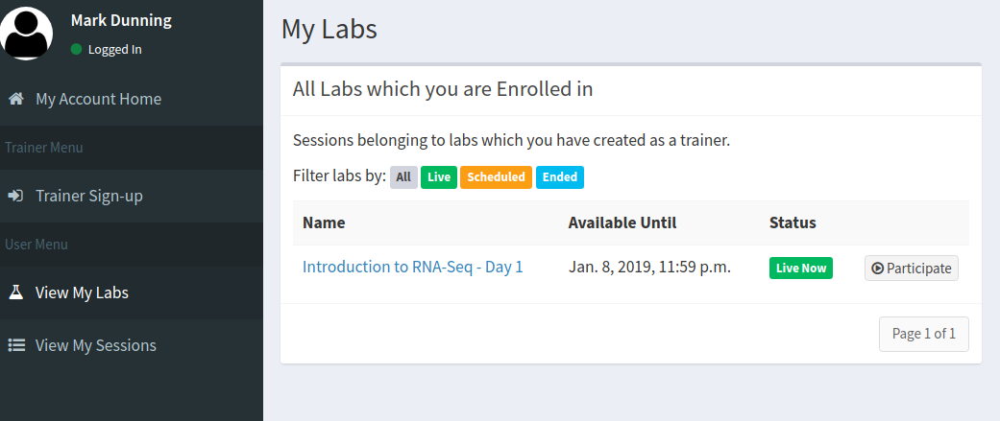
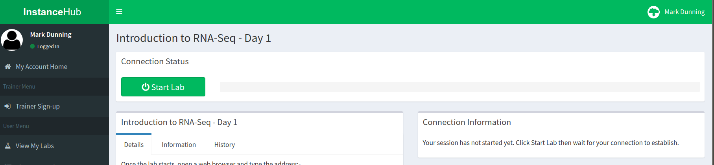
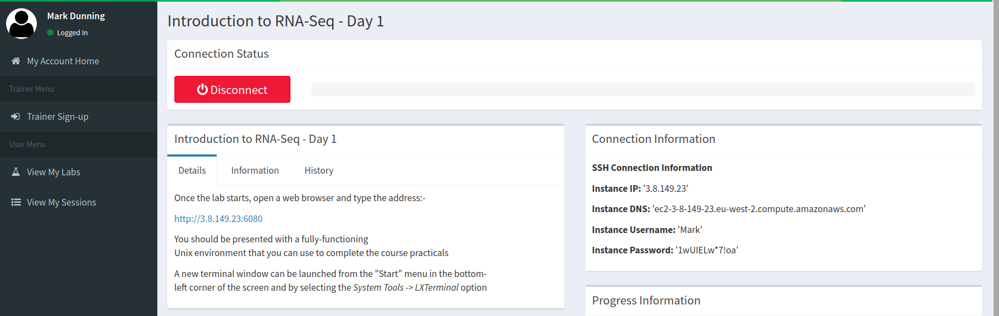
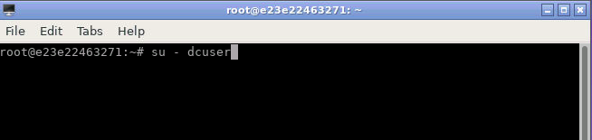

```{r setup, include=FALSE}
knitr::opts_chunk$set(echo = TRUE)
```

# Course Setup for Day 1

In this course we will demonstrate how to run some standard analysis tools for RNA-seq data. The majority of Bioinformatics tools are built with a *command-line* environment in mind, rather than Windows or Mac OSX. To simplify the installation of these tools, we are providing some resources on the *cloud* that you can log into for the duration of the course. 

## 1. Create an account at InstanceHub

*InstanceHub* is a tool created at The University of Sheffield for creating cloud resources for computing practicals. You will need to go to [instancehub.com](instancehub.com) and create an account. **Make sure that you specify the same email address that you signed-up to the course**.


## 2. Launch the Lab 

Choose the menu option *View my labs* on the left-hand menu. The lab **Introduction to RNA-seq - Day 1** should be visible. Click the *Participate* button.



## 3. Connect to the lab

Press the *Start Lab* (green) button and wait whilst the lab loads...



Once *Start Lab* has been replaced by *Disconnect*, the *Connection Information* tab will be updated with an IP address etc.



Enter the following address in your web browser 

Replacing **IP_ADDRESS** with the numbers next to **Instance IP** in the *Connection Information* box.

```
http://IP_ADDRESS:6080
```

e.g. 

```
http://3.8.149.23:6080
```

**Do not click Disconnect**

## 4. Open a termninal window

You should be presented with a unix desktop environment that we can use to learn about the command-line and tools for processing RNA-seq data.

To open a *Terminal* (in order to enter Unix commands), there is a "Start menu" in the bottom-left corner from which you can select *System Tools* and then *LXTerminal*


## 5. Change user

Finally, in order to follow the materials we need to change the user that we logged in as from `root` to `dcuser`.

Type the command into the terminal window exactly as it appears below

```
su - dcuser
```



# Course Setup for Day 2

On the second day of the course we will be performing analysis in Rstudio. It would be preferable to run this locally on your own machine so everything is setup for you after the course.

You will need to install the latest version of R **and** RStudio as per the instructions on the [course home page](http://sbc.shef.ac.uk/training/rna-seq-in-r-2019-01-14/#software-installation)

The copy-and-paste the following R code into the R console:-

```{r}
install.packages("BiocManager")
BiocManager::install(c("limma", 
         "org.Mm.eg.db", 
         "RColorBrewer", 
         "TxDb.Mmusculus.UCSC.mm10.knownGene",
         "goseq",
         "fgsea",
         "DESeq2",
         "pheatmap",
         "rmarkdown",
         "tximport",
         "clusterProfiler",
         "DOSE",
         "pathview",
         "biomaRt"),update=FALSE)

```


### Backup resource if local installation does not work

If there are serious problems installing the course software, we also have cloud compute available. Follow steps 1 to 3 the same as for Day 1, except starting the *Introduction to RNA-seq - Day 2* lab. 


Once the connection details have appeared, enter the *Connection IP* details in a web browser with `:8787` afterwards.


e.g. 

```
3.8.181.100:8787
```

This should launch a pre-configured version of RStudio in your browser. The password is **rstudio** and the password is **sbc20190115**


# Setup on your own machine

You can launch the same computing environment on your own machine using a tool called *Docker*.

Docker is an open platform for developers to build and ship applications, whether on laptops, servers in a data center, or the cloud.

- Or, it is a (relatively) painless way for you to install and try out Bioinformatics software.
- You can think of it as an isolated environment inside your exising operating system where you can install and run software without messing with the main OS
    + Really useful for testing software
    + Clear benefits for working reproducibly
- Instead of just distributing the code used for a paper, you can effectively share the computer you did the analysis on
- For those of you that have used Virtual Machines, it is a similar concept


## Installing Docker


### Mac

- [Mac OSX - 10.10.3 or newer](https://www.docker.com/docker-mac)
- [Older Macs](https://download.docker.com/mac/stable/DockerToolbox.pkg)

### Windows

- [Windows 10 Professional](https://www.docker.com/docker-windows)
- [Other Windows](https://download.docker.com/win/stable/DockerToolbox.exe)

Once you have installed Docker using the insructions above, you can open a terminal (Mac) or command prompt (Windows) and type the following to run the Day 1 environment

```
docker run --rm -p 6080:80 markdunning/rnaseq-toolbox
```

Entering the address in your web browser should display the environment

```
http://localhost:6080
```

### Day 2 

We also have a docker container for Day 2. Install docker using the instructions above, and run the following command in a terminal or command prompt.

```
docker run --rm -e PASSWORD=password -p 8787:8787 markdunning/rnaseq-r
```

Entering the following address in a web browser should open an RStudio instance. The username is `rstudio` and the password is `password`. 

```
http://localhost:8787
```
The RStudio version should have all the packages pre-installed and a blank markdown file `analysis.Rmd` that you can start working through the materials with.

### Using the environment to analyse your own data

With the default settings, the computing environment is isolated from your own laptop; we can neither bring files that we create back to our own OS, or analyse our own data.

However, adding an `-v` argument allows certain folders on your own OS to be visible within the enviroment. 

Assuming the files I want to analyse are to be found in the folder `PATH_TO_FASTQ`, the following command would map that directory to the folder `/home/dcuser/rnaseq_data`

```
docker run --rm -p 6080:80 -v /PATH_TO_FASTQ/:/home/dcuser/rnaseq_data markdunning/rnaseq-toolbox
```

At the terminal, we should be able to see our files with the `ls` command

```
ls /home/dcuser/rnaseq_data
```


